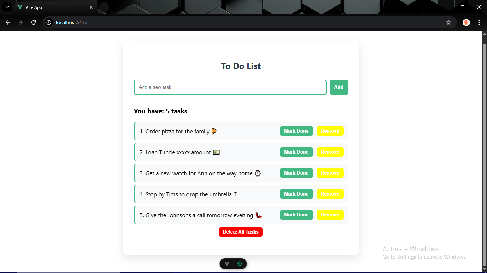

# 📝 Project 1: Vue Todo List — Completed Solution

**Difficulty:** ★☆☆☆☆ (Beginner)
**Tech Stack:** Vue 3 + Composition API (`<script setup>`)

---

## Overview of Implementation

This is the completed implementation of the Vue Todo List project.

The application allows users to:

* Add tasks
* Prevent empty submissions
* Render tasks dynamically
* Automatically update the interface when state changes
* Experience small UX enhancements like animations and styling polish

The central goal of this project is to demonstrate Vue’s reactive rendering model: when application state changes, the DOM updates automatically. No manual DOM manipulation is required.

This solution reflects a clean, minimal, but production-aware implementation.

---

## Screenshot


---

## Architecture Explanation

The solution follows a simple reactive component structure using the Composition API:

* Reactive state is defined using `ref()`
* All state mutations occur inside dedicated functions
* The template renders directly from reactive state
* No external state managers or DOM APIs are used

Core reactive state:

```js
const tasks = ref([])
const newTask = ref("")
```

The component owns its state entirely. There is no shared or global state. All rendering derives from these two reactive values.

This keeps the architecture simple, predictable, and easy to reason about.

---

## Key Patterns Used

### 1. Reactive State with `ref()`

Both the tasks array and the input value are reactive:

```js
const tasks = ref([])
const newTask = ref("")
```

Important distinction:

* Inside `<script setup>`, you must use `.value`
* Inside `<template>`, Vue automatically unwraps refs

Understanding this difference is critical for Vue 3 fluency.

---

### 2. Controlled Event-Driven Mutation

State mutations occur only inside functions:

```js
function addTask() {
  if (!newTask.value.trim()) return
  tasks.value.push(newTask.value.trim())
  newTask.value = ""
}
```

This pattern ensures:

* Input validation happens before state mutation
* Only trimmed, valid values enter the array
* The input resets after submission
* The UI updates automatically due to reactivity

---

### 3. Declarative Rendering with `v-for`

Tasks are rendered dynamically using:

```html
<li v-for="(task, index) in tasks" :key="index">
  {{ task }}
</li>
```

The `:key` enables efficient virtual DOM reconciliation. Even though index is acceptable for this small app, future improvements can replace it with unique IDs.

---

### 4. Light UX Enhancements

This implementation introduces:

* Input trimming
* Smooth fade-in animation
* Button active-state feedback
* Structured spacing and Vue-themed styling (#42b983)

These additions improve usability without complicating architecture.

---

## State Flow Explanation

Here is the full reactive loop in motion:

1. The user types into the input.
2. `v-model` updates `newTask`.
3. The user clicks "Add".
4. `addTask()` executes.
5. If valid, the task is pushed into `tasks`.
6. Vue detects mutation of a reactive value.
7. The DOM re-renders automatically.
8. The new item appears instantly.

There is no manual rendering logic.
There are no DOM selectors.
There is no imperative UI update.

State changes → Vue re-renders.

That mental model is the foundation of modern frontend systems.

---

## Why This Approach

This implementation favors:

* Simplicity
* Predictable state mutations
* Clear separation between data and UI
* Declarative rendering
* Minimal abstraction

For a beginner project, clarity is more important than cleverness.

There are no watchers.
No computed properties.
No external utilities.

Just reactive state and pure functions.

This keeps the cognitive load low while reinforcing core ideas.

---

## Possible Improvements

Although functional and clean, the implementation can be extended:

* Replace index-based keys with unique IDs
* Store tasks in `localStorage` to persist between reloads
* Add deletion functionality
* Add task completion toggle
* Add task count tracking
* Enable submission via Enter key
* Extract task item into its own component
* Introduce basic transition components instead of manual CSS animations

Each improvement introduces deeper architectural discussions:
state normalization, identity, persistence, composables, and component composition.

---

## Screenshot

Here is a screenshot of the enhanced solution
## Screenshot



---

This solution is intentionally small.

But the principles inside it scale to:

* Dashboards
* Admin panels
* SaaS platforms
* Enterprise tools

The mechanics do not change.
State drives UI.
Everything else is abstraction layered on top.
